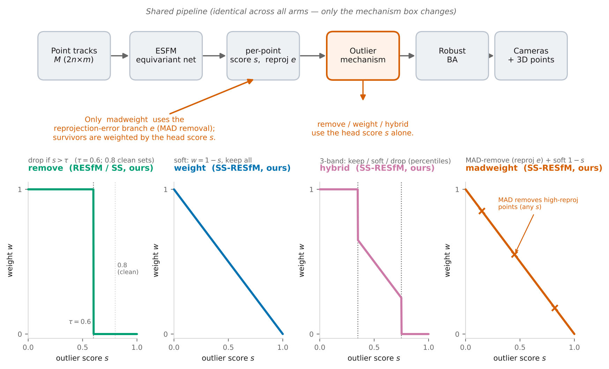

# SS-RESfM

> **Self-Supervised Robustness in Deep Structure-from-Motion** — what happens when you
> remove the outlier supervision from RESfM, and why that question matters more than it
> sounds.

## What this is

RESfM rejects outlier correspondences with a classifier supervised by COLMAP-derived
labels — supervision that presupposes a trusted reconstruction of the very scenes whose
contamination makes reconstruction hard. **SS-RESfM** replaces that supervision with a
self-supervised loss (confident pseudo-labels from percentiles of the model's own
reprojection error) inside an otherwise byte-identical pipeline, and uses the pair as an
instrument to study *when outlier supervision fails*.

*The pipeline. All arms share tracks, the sets-of-sets equivariant network, and robust
BA; only the outlier-mechanism block differs (bottom: the four mechanisms as
weight-vs-signal transfer functions). The head trains self-supervised — confident
pseudo-labels from percentiles of the model's own reprojection error — with no
ground-truth or COLMAP labels anywhere.*

Headline findings (details and exact numbers in the paper drafts under `claude specs/`):

1. **The label ceiling is causal** — COLMAP-regenerated labels collapse (recall
   0.82 → ~0.3) above ~15% contamination, and retraining supervised RESfM *on* a
   60%-contaminated domain with best-case GT-derived labels still loses ~2× to
   label-free removal. At 60%, GT-supervised classification performs identically to no
   outlier mechanism at all.
2. **The optimal mechanism flips with contamination** — hard removal wins the
   high-contamination regime (beating the supervised baseline on every seed pair at
   ~60%), soft reweighting wins clean OOD; supervision keeps only the curated
   25–43% middle band.
3. **Reliability is the qualitative differentiator** — label-free arms land in a narrow
   band on every training seed; supervised recipes are seed-bimodal on clean OOD data
   (and even in-domain), a failure mode invisible to the field's single-seed reporting.
   Our seed-additivity analysis shows single-seed comparisons can reverse the verdict
   on four of six datasets.
4. **The oracle-cleaning ceiling** — at 60% contamination, label-free removal on
   contaminated tracks beats the same architecture on *oracle-cleaned* tracks
   (12.4±2.1 vs. ESFM\* 18.12±4.35; 23 of 25 seed pairs): deleting 60% of
   observations — even correctly — starves the constraint structure. How labels are
   used matters as much as having them.
5. **A reusable robustness benchmark** — rebuilt track suites for five OOD datasets
   (0.5–61% measured contamination) with GT-derived labels and per-domain splits, plus
   5-seed bands for every baseline in RESfM's comparison set (ESFM, ESFM*, GASFM,
   GLOMAP, COLMAP).

## Headline numbers

Post-BA mean translation error, five-training-seed bands (lower is better; best per
column **bold**). Full tables, medians, rotation, and per-scene results in the paper
drafts.

**In-distribution**: MegaDepth (the training domain). **Out-of-distribution**, ordered
by rising contamination: Olsson → Strecha → BMVS → 1DSfM → 1DSfM-hard.

| Method | MegaDepth 25% *(in-dist)* | Olsson 0.5% *(OOD)* | Strecha 1.7% *(OOD)* | BMVS 3.1% *(OOD)* | 1DSfM 43% *(OOD)* | 1DSfM-hard 60% *(OOD)* |
|---|---|---|---|---|---|---|
| **SS-RESfM (best arm)**¹ | 0.40±0.11 (wttt) | **2.9±0.3** (weight) | 1.97±0.09 (weight) | **0.14±0.02** (soft) | **8.9±1.2** (rm+TTT) | **12.4±2.1** (remove) |
| — SS madweight | 0.51±0.08 | 3.0±0.3 | 2.65±0.25 | 0.14±0.02 | 11.0±1.7 | 18.9±4.1 |
| — SS weight | 0.51±0.09 | 2.9±0.3 | 1.97±0.09 | 0.14±0.03 | 14.4±3.0 | 22.9±2.8 |
| — SS weight+TTT | 0.40±0.11 | 8.0±0.3 | 2.00±0.05 | 0.14±0.02 | 15.7±2.1 | 22.2±3.2 |
| — SS remove | 0.51±0.08 | 3.4±0.6 | 3.20±0.11 | 0.24±0.06 | 9.1±2.2 | 12.4±2.1 |
| — SS remove+TTT | 0.56±0.07 | 3.6±0.4 | 3.01±0.07 | 0.22±0.10 | 8.9±1.2 | 15.2±1.0 |
| — SS hybrid (3-band) | 0.45±0.08 | 2.90±0.23 | 3.25±0.45 | 0.14±0.02 | 16.23±2.20 | 22.98±4.02 |
| RESfM (scratch, our ckpt selection)² | **0.37±0.12** | 7.4±2.6 | **0.39±0.72** | 0.35±0.04 | 10.5±1.5 | 19.2±3.4 |
| RESfM (scratch, authors' selection)² | 0.496 | 8.77 | 0.144 | 0.367 | 9.75 | 17.58 |
| RESfM (released ckpt) | 0.203 | 9.10 | 0.20 | 0.33 | 10.71 | 15.29 |
| ESFM (same tracks, no mech.) | 0.71±0.11 | 5.91±3.32 | 2.03±0.14 | 6.45±3.75 | 18.42±0.75 | 21.76±0.80 |
| ESFM\* (oracle-clean tracks) | 0.60±0.18 | — | 1.14±0.45 | 3.79±3.51 | 13.24±0.52 | 18.12±4.35 |
| GASFM (released, our BA) | 2.25 | 4.45 | 1.14 | 11.13 | 25.84 | 36.49 |
| GLOMAP (classical) | 3.33 | 3.17 | **0.047** | 0.339 | 27.21 | 35.42 |
| COLMAP (incremental) | 0.62±0.03 | 0.20±0.00 | 0.03±0.00 | 0.01±0.00 | 6.29±0.42³ | 20.4±1.1 |

³ *COLMAP errors are computed over its registered cameras only (a favorable convention; at 43–60% it registers substantially fewer than the learned methods).*

² *The two from-scratch RESfM rows differ only in checkpoint selection. "Our ckpt
selection" picks the epoch by the same label-free reprojection-error validation
criterion used for every SS-RESfM arm (the controlled comparison; five-seed band).
"Authors' selection" picks by RESfM's own Accuracy metric — the released recipe,
faithful to the paper (single run; its five-seed band reproduces the scratch band on
every dataset). Our deviation demonstrably favors the baseline: under the authors' own
rule it is weaker on MegaDepth (0.496 vs. 0.37), so all supervised-baseline margins we
report are lower bounds — and the Olsson collapse persists under either rule.*

¹ *"Best arm" is a per-dataset selection over the five SS-RESfM mechanism variants
listed below it — not a single deployable configuration. The optimal mechanism flips
with contamination (removal high, reweighting low), which is itself the paper's
complementarity finding; no cheap unsupervised selector reliably picks the winner
per scene (see the selector study in the paper).*

In-distribution causal check (train on the domain itself, best-case GT labels):
at 60%, label-free MAD 12.1±6.1 vs. supervised 23.4±7.8 vs. no-mechanism 23.1±5.9 —
supervision with perfect labels adds nothing over no mechanism at either extreme of
the contamination axis (60% and 0.5%), earning its keep only in the curated 25–43%
middle band.

## Architecture & training-pool variants (single seed — preliminary)

*Seed-20 only; our own seed-additivity analysis shows single-seed verdicts can flip, so
read these as directions, not conclusions. Full grids in the paper appendices.*

**Deep (2×3) self-supervised arms vs. shallow** (selected cells, translation mean):
deep helps in distribution (MegaDepth remove 0.41, hybrid 0.40 vs. shallow ~0.51) and
shows striking single-seed wins on Strecha (deep madweight 0.23 vs. shallow 2.65) and
1DSfM (deep remove 6.77 vs. shallow 9.1) — unbanded, so unclaimed.

**Training-pool diversity (supervised)**: growing the pool MegaDepth-27 → +ETH3D (39) →
+VGG/T&T (52) degrades clean-OOD Strecha monotonically (0.006 → 0.77 → 2.83) while
in-distribution stays flat — diversity's label cost lands exactly on clean OOD.

**The Olsson-collapse 2×2** (clean-OOD, supervised): neither depth alone (deep on
MD-27: 8.58) nor diversity alone (shallow on 52 scenes: 9.30) rescues the collapse;
only their combination does (deep-52: 2.26; +LayerNorm 2.83) — while every label-free
arm reaches the same level from the cheapest cell (shallow, MD-27 only).

### Deep (2×3) variants — seed 20, MegaDepth-27 training

| Arm | MegaDepth | Olsson | Strecha | BMVS | 1DSfM | 1DSfM-hard |
|---|---|---|---|---|---|---|
| deep SS madweight | 0.64 | — | **0.23** | 0.13 | 12.49 | — |
| deep SS weight | 0.56 | — | 1.05 | **0.03** | 17.82 | — |
| deep SS weight+TTT | 0.45 | — | 0.81 | 0.15 | 15.16 | — |
| deep SS remove | 0.41 | — | 3.33 | 0.05 | **6.77** | — |
| deep SS remove+TTT | 0.52 | — | 2.62 | 0.14 | 9.22 | — |
| deep SS hybrid | **0.40** | — | 2.61 | 0.12 | 15.31 | — |
| deep supervised (RESfM-deep) | 0.56 | 8.58 | **0.005** | 0.048 | 14.87 | — |

### Training-pool (multids) variants — seed 20

Three training pools of increasing size and diversity, each built by adding datasets
to the previous one:

- **27 scenes** — MegaDepth only (the pool used everywhere else in this README);
- **39 scenes** — the 27 above **+ 12 ETH3D scenes** (a relatively clean addition,
  ~8% measured contamination);
- **52 scenes** — the 39 above **+ VGG and Tanks&Temples scenes** (a contaminated
  mid-band addition, ~16%).

Supervised labels for the added scenes are GT-derived (COLMAP labels don't exist for
them). Row naming: recipe · architecture · pool size — e.g. "SUP shallow, 39" =
supervised, 1×3 architecture, trained on the 39-scene pool.

| Recipe × pool | MegaDepth | Olsson | Strecha | BMVS | 1DSfM | 1DSfM-hard |
|---|---|---|---|---|---|---|
| SUP shallow, 39 | 0.32 | — | 0.77 | 0.38 | 11.48 | 18.43 |
| SUP shallow, 52 | 0.44 | 9.31 | 2.83 | 2.84† | 8.84 | **13.96** |
| SUP deep, 52 | **0.26** | **2.26** | — | — | — | — |
| SUP deep+LayerNorm, 52 | 0.37 | 2.83 | 1.65 | — | 14.45 | — |
| SS mad shallow, 39 | — | — | 2.99 | 0.30† | 11.42 | 19.03 |
| SS mad shallow, 52 | — | — | 2.88 | 0.22† | **6.43** | 20.57 |
| SS mad deep, 52 | 0.47 | — | 0.72 | 0.30 | 11.52 | — |
| SS weight deep, 52 | 0.48 | — | **0.28** | 0.15 | 15.96 | — |

*Both tables are seed-20 single runs (our seed-additivity analysis applies — directions,
not conclusions); "—" = never evaluated. † = 9-scene extended BMVS set, not comparable
to the 4-scene cells elsewhere. Notable single-seed signals: the contaminated mid-band
pool helps SS-mad on 1DSfM too (11.0 → 6.43), and depth+diversity lets the SS soft arm
close Strecha (0.28) — both awaiting banding before any claim.*

## Repository map

| Path | Contents |
|---|---|
| `code/` | Training/eval pipeline (fork of the official RESfM codebase): `multiple_scenes_learning.py`, `single_scene_optimization.py`, `run_multiscene_eval.sh` |
| `code/confs/` | Every training and evaluation configuration (per arm × dataset × seed) |
| `code/build_tracks/` | Appendix-C track builder (SIFT+RANSAC), GT labeling, frame mapping |
| `code/verify_iclr_tables.py` | Recomputes every printed table cell from saved eval outputs |
| `claude specs/` | Paper drafts (`ICLR_ssresfm.tex` = full-length master; `CVPR_ssresfm.tex` + supp = submission-shaped), figures, the Short Summary, and the resume handbook |
| `papers and code/` | Upstream reference code (RESfM, ESFM, GASFM) with minimal patches |

Results and datasets live outside git (cluster storage); `RUN_MULTISCENE.md` in `code/`
documents the training/eval workflow.

## Lineage & acknowledgements

This project builds directly on the official implementations of
[RESfM](https://github.com/FadiKhatib/resfm) (Khatib, Kasten, Moran, Galun, Basri) and
[ESFM](https://github.com/drormoran/Equivariant-SFM) (Moran et al.) — see their repositories for licenses.
Benchmarks: MegaDepth, 1DSfM, Strecha, BlendedMVS, and Olsson's dataset. Developed at
the Weizmann Institute of Science.
